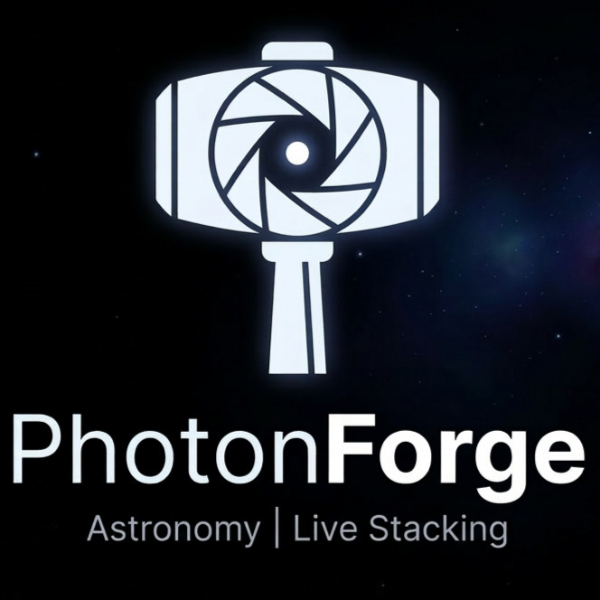

# PhotonForge



**High-performance astronomical live stacker for macOS.**

PhotonForge captures frames from a modified webcam (Logitech C310 at prime focus), aligns them using ORB feature matching, and accumulates them into a 32-bit floating-point stack — pulling faint deep-sky detail out of noisy single exposures in real time.

## Features

- **Live Stacking** — 32-bit float accumulator with additive summation
- **ORB Alignment** — Automatic star detection, RANSAC homography, and frame warping
- **Histogram Stretch** — Black level, gamma, and white point sliders for real-time visibility
- **Simulator Mode** — Stream test images with synthetic jitter for daytime development
- **Star Catalog** — SQLite database with HYG (stars) and OpenNGC (DSOs) import
- **Session History** — Log every stacking session with metadata
- **Debug Overlay** — Visualize matched keypoints to verify alignment quality

## Stack

- **Go** with goroutine-based alignment worker
- **GoCV** (OpenCV 4) for image processing
- **Fyne v2** for native macOS UI
- **SQLite** for object catalog and session storage

## Quick Start

```bash
# Prerequisites
brew install opencv

# Run with webcam
go run .

# Run with test images
go run tools/gen_test_stars.go   # generate synthetic starfields
go run . -mode=test -dir=sim

# Import star catalogs
go run . -mode=ingest -hyg=data/hygdata_v42.csv -ngc=data/NGC.csv

# Search the catalog
go run . -search="Orion"

# Debug mode (show alignment keypoints)
go run . -mode=test -dir=sim -debug
```

## Flags

| Flag | Default | Description |
|------|---------|-------------|
| `-mode` | `webcam` | Input mode: `webcam`, `test`, or `ingest` |
| `-device` | `0` | Webcam device ID |
| `-dir` | `sim` | Test image directory |
| `-jitter` | `true` | Simulate tracking drift in test mode |
| `-debug` | `false` | Show ORB keypoint overlay |
| `-db` | `photonforge.db` | SQLite database path |
| `-hyg` | | HYG star catalog CSV path |
| `-ngc` | | OpenNGC deep-sky catalog CSV path |
| `-search` | | Search catalog by name and exit |

## License

MIT
